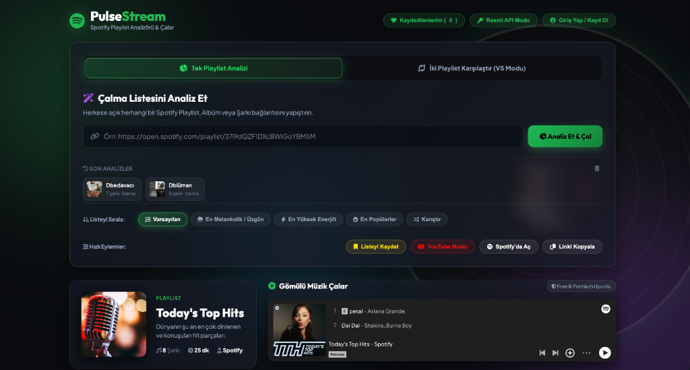
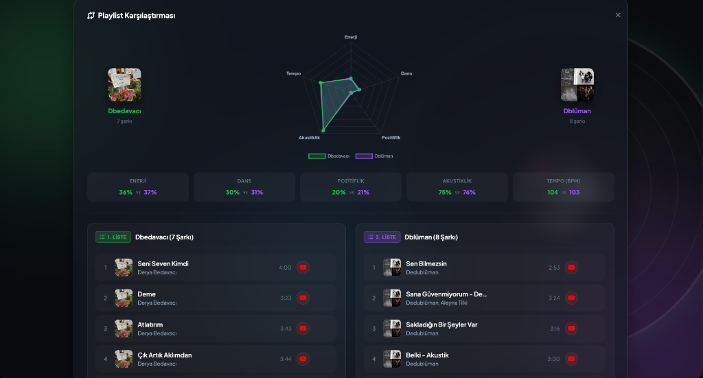
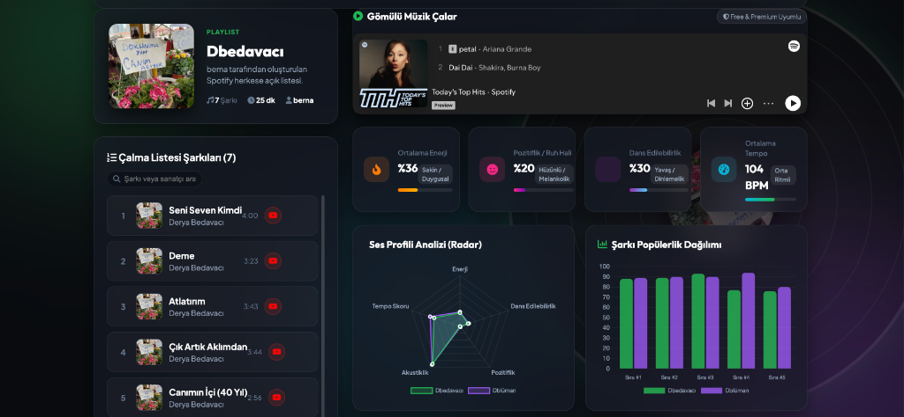

# PulseStream: Spotify Playlist AI Analyzer & Comparison Platform

PulseStream, Spotify çalma listelerini derinlemesine analiz eden, ses metriklerini karşılaştıran ve görsel veri panelleri sunan yapay zeka odaklı bir web uygulamasıdır. 

Bu proje, yapay zeka (AI) ve veri işleme teknolojilerini öğrenme sürecinde pratik deneyim kazanmak ve teorik kavramları pekiştirmek amacıyla geliştirilmiştir.

---

## Ekran Görüntüleri ve Arayüz Yapısı

### 1. Ana Arama ve Mod Seçim Paneli
Kullanıcının tekli playlist analizi ile ikili playlist karşılaştırma (VS) modları arasında geçiş yapmasını sağlayan şeffaf cam efektli (Glassmorphic) arayüz.



### 2. İkili Playlist Karşılaştırması (VS Modu)
İki farklı Spotify çalma listesinin şarkılarının yan yana listelendiği, ses profili farklarının gösterildiği karşılaştırma ekranı.



### 3. Ses Profili ve Popülerlik Analiz Paneli
Radar grafik (Ses Profili) ve Bar grafik (Popülerlik Dağılımı) ile playlist metriklerinin çok boyutlu görselleştirmesi.



### 4. Öne Çıkan Sanatçılar ve Bağlamsal Özet
Listenin en çok tekrarlanan sanatçıları ve metrik farklarına göre dinamik olarak oluşturulan içerik özeti.


---

## Yapay Zeka Öğrenme Sürecinde Pekiştirilen Kavramlar

Bu projenin geliştirilmesi sırasında aşağıdaki temel yapay zeka, veri bilimi ve yazılım mimarisi kavramları uygulamalı olarak pekiştirilmiştir:

### 1. Retrieval-Augmented Generation (RAG) Mimarisi
Proje, veri getirme, veriyi zenginleştirme ve çıktı üretme adımlarını kapsayan RAG yapısını simüle etmektedir:
* **Retrieval (Veri Getirme):** Spotify gömülü sayfalarından `__NEXT_DATA__` SSR verileri Python backend aracılığıyla çekilir.
* **Augmentation (Veri Zenginleştirme):** Şarkıların ses özellikleri (Enerji, Dansabilite, Pozitiflik, Akustiklik, Tempo) deterministik vektör metriklerine dönüştürülür.
* **Generation (Çıktı Üretimi):** Zenginleştirilen veri kümesinden iki playlist arasındaki atmosfer farklarını açıklayan metinsel özetler ve çok boyutlu radar/bar grafikleri üretilir.

### 2. Çok Kriterli Veri Sıralama ve Eşzamanlı Senkronizasyon
* Liste üzerindeki parçaların melankoli (Valence), enerji ve popülerlik skoru değerlerine göre sıralanması.
* İkili karşılaştırma modunda her iki listenin bağımsız ve eşzamanlı olarak aynı kuralla sıralanması.

### 3. Çok Boyutlu Veri Görselleştirme (Multi-Dimensional Data Visualization)
* Ses metriklerinin 5 eksenli Radar Grafiği üzerinde çakıştırılarak görselleştirilmesi.
* Şarkı popülerlik skorlarının grup bar grafikler üzerinde karşılaştırılması.

### 4. Kullanıcı Durum Yönetimi ve İstemci Tarafı Kalıcılık
* LocalStorage tabanlı oturum yönetimi, geçmiş aramalar ve kullanıcıya özel favori liste saklama paneli.

---

## Proje Özellikleri

* **Tekli Playlist Analizi:** Herkese açık Spotify bağlantılarının ses profili, ortalama süresi ve metrik analizi.
* **Çiftli Playlist Karşılaştırması (VS Modu):** İki listenin radarda üst üste bindirilmiş grafik analizi ve side-by-side şarkı karşılaştırması.
* **Akıllı Sıralama:** Melankoli, Enerji, Popülerlik ve Karıştırma modları.
* **YouTube Music Entegrasyonu:** Spotify 30 saniye önizleme kısıtlamasını aşmak için her şarkının yanındaki YouTube Music doğrudan dinleme bağlantısı.
* **Kullanıcı Hesabı ve Favori Listeler:** Kullanıcı oturumu ile favori playlist saklama ve kayan yan panel (Drawer).

---

## Teknik Mimarisi

* **Frontend:** HTML5, Vanilla CSS3 (Custom Glassmorphism Design System), Javascript (ES6+), Chart.js
* **Backend:** Python 3 (Multi-threaded HTTP Server, Scraper Engine)
* **Veri Kaynağı:** Spotify Open Embed Metadata API Parsing

---

## Kurulum ve Çalıştırma

1. Proje dizininde sunucuyu başlatın:
```bash
python3 server.py
```

2. Tarayıcıda uygulamayı açın:
```text
http://localhost:3005
```

---

## Lisans

Bu proje eğitim ve kişisel gelişim amacıyla hazırlanmıştır.
