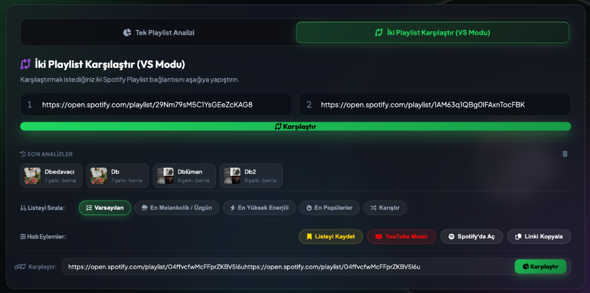
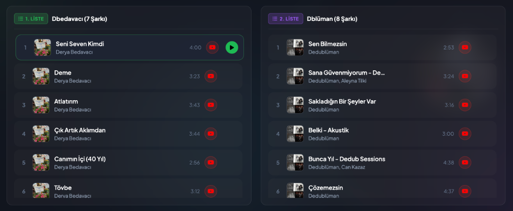
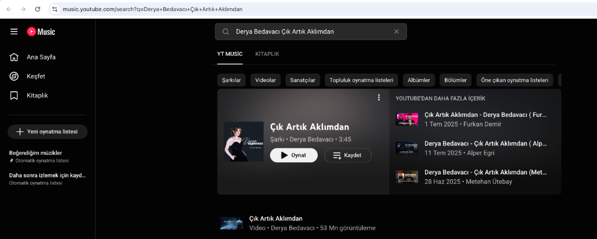

# PulseStream: Spotify Playlist AI Analyzer & Comparison Platform

> **Herkese açık çalma listelerini analiz eden, karşılaştıran ve yorumlayan bir makine!**

PulseStream, Spotify çalma listelerini derinlemesine analiz eden, ses metriklerini karşılaştıran ve görsel veri panelleri sunan yapay zeka odaklı bir web uygulamasıdır.

> **Önemli Kullanım Notu:** Çalma listelerinizin analiz edilebilmesi ve karşılaştırılabilmesi için Spotify üzerinde **"Herkese Açık" (Public)** konumda olması gerekmektedir. Gizli veya kişiye özel listeler üzerinde analiz ve karşılaştırma yapılamaz.

Bu proje, yapay zeka (AI) ve veri işleme teknolojilerini öğrenme sürecinde pratik deneyim kazanmak ve teorik kavramları pekiştirmek amacıyla geliştirilmiştir.

---

## Ekran Görüntüleri ve Arayüz Yapısı

### 1. Ana Arama ve Mod Seçim Paneli
Kullanıcının tekli playlist analizi ile ikili playlist karşılaştırma (VS) modları arasında geçiş yapmasını sağlayan şeffaf cam efektli (Glassmorphic) arayüz.


### 2. İki Playlist Karşılaştır (VS Modu) Arama Arayüzü
Karşılaştırılmak istenen 1. ve 2. Spotify playlist bağlantılarının yan yana girildiği ve hızlı karşılaştırmanın tetiklendiği özel arama kartı.



### 3. İkili Playlist Karşılaştırması ve Yan Yana Listeler
İki farklı Spotify çalma listesinin şarkılarının yan yana listelendiği, ses profili farklarının gösterildiği karşılaştırma ekranı.


### 4. Ses Profili ve Popülerlik Analiz Paneli
Radar grafik (Ses Profili) ve Bar grafik (Popülerlik Dağılımı) ile playlist metriklerinin çok boyutlu görselleştirmesi.


### 5. Öne Çıkan Sanatçılar ve Bağlamsal Özet
Listenin en çok tekrarlanan sanatçıları ve metrik farklarına göre dinamik olarak oluşturulan içerik özeti.


### 6. Şarkı Önizleme ve Canlı Oynatıcı Paneli
Şarkı satırına veya yeşil oynatma butonuna tıklandığında parçanın 30 saniyelik ses önizlemesinin canlı oynatıcıya yüklenmesi ve plak animasyonunun aktifleşmesi.



### 7. Tam Parça Dinleme (YouTube Music Entegrasyonu)
Spotify 30 saniye kısıtlamasını aşmak için her şarkının sağ tarafında otomatik olarak oluşturulan ve kullanıcının şarkının tamamını dinlemesini sağlayan YouTube Music arama/yönlendirme sayfası.



---

## Yapay Zeka Öğrenme Sürecinde Pekiştirilen Kavramlar

Bu projenin geliştirilmesi sırasında aşağıdaki temel yapay zeka, veri bilimi ve yazılım mimarisi kavramları uygulamalı olarak pekiştirilmiştir:

### 1. Retrieval-Augmented Generation (RAG) Mimarisi
Proje, veri getirme, veriyi zenginleştirme ve çıktı üretme adımlarını kapsayan RAG yapısını simüle etmektedir:
* **Retrieval (Veri Getirme):** Spotify gömülü sayfalarından `__NEXT_DATA__` SSR verileri Python backend aracılığıyla çekilir.
* **Augmentation (Veri Zenginleştirme):** Şarkıların ses özellikleri (Enerji, Dansabilite, Pozitiflik, Akustiklik, Tempo) deterministik vektör metriklerine dönüştürülür.
* **Generation (Çıktı Üretimi):** Zenginleştirilen veri kümesinden iki playlist arasındaki atmosfer farklarını açıklayan metinsel özetler ve çok boyutlu radar/bar grafikleri üretilir.

### 2. Çok Kriterli Veri Sıralama ve Eşzamanlı Senkronizasyon
* Liste üzerindeki parçaların melankoli (Valence), enerji ve popülerlik skoru değerlerine göre sıralanması.
* İkili karşılaştırma modunda her iki listenin bağımsız ve eşzamanlı olarak aynı kuralla sıralanması.

### 3. Dinamik Oynatıcı Mimarisi ve Dış Servis Entegrasyonu (YouTube Music API Bridge)
* **30 Saniyelik Ses Önizleme:** Şarkı satırına veya yeşil çalma ikonuna basıldığında parçanın 30 saniyelik ses örneğinin HTML5 Audio ve Spotify Embed oynatıcısı üzerinde anında çalması.
* **Tam Parça Dinleme Yönlendirmesi:** Spotify ücretsiz üyelik sınırlamasını aşmak adına, şarkının tamamını kesintisiz dinlemek isteyen kullanıcılar için otomatik olarak şarkı adı ve sanatçı bilgisiyle beslenen doğrudan YouTube Music yönlendirme butonları.

### 4. Çok Boyutlu Veri Görselleştirme (Multi-Dimensional Data Visualization)
* Ses metriklerinin 5 eksenli Radar Grafiği üzerinde çakıştırılarak görselleştirilmesi.
* Şarkı popülerlik skorlarının grup bar grafikler üzerinde karşılaştırılması.

### 5. Kullanıcı Durum Yönetimi ve İstemci Tarafı Kalıcılık
* LocalStorage tabanlı oturum yönetimi, geçmiş aramalar ve kullanıcıya özel favori liste saklama paneli.

---

## Proje Özellikleri

* **Tekli Playlist Analizi:** Herkese açık Spotify bağlantılarının ses profili, ortalama süresi ve metrik analizi.
* **Çiftli Playlist Karşılaştırması (VS Modu):** İki listenin radarda üst üste bindirilmiş grafik analizi ve side-by-side şarkı karşılaştırması.
* **30 Saniyelik Şarkı Çalma & Önizleme:** Şarkı satırına veya yeşil oynat butonuna basıldığında şarkının önizleme sesinin anında çalması.
* **Tam Parça Dinleme (YouTube Music Butonu):** Şarkının tamamını dinlemek isteyenler için her satırın yanında otomatik YouTube Music yönlendirme bağlantısı.
* **Akıllı Sıralama:** Melankoli, Enerji, Popülerlik ve Karıştırma modları.
* **Kullanıcı Hesabı ve Favori Listeler:** Kullanıcı oturumu ile favori playlist saklama ve kayan yan panel (Drawer).

---

## Teknik Mimarisi

* **Frontend:** HTML5, Vanilla CSS3 (Custom Glassmorphism Design System), Javascript (ES6+), Chart.js
* **Backend:** Python 3 (Multi-threaded HTTP Server, Scraper Engine)
* **Veri Kaynağı:** Spotify Open Embed Metadata API Parsing

---

## Kurulum ve Çalıştırma

1. Proje dizininde sunucuyu başlatın:
```bash
python3 server.py
```

2. Tarayıcıda uygulamayı açın:
```text
http://localhost:3005
```

---

## Lisans

Bu proje eğitim ve kişisel gelişim amacıyla hazırlanmıştır.
